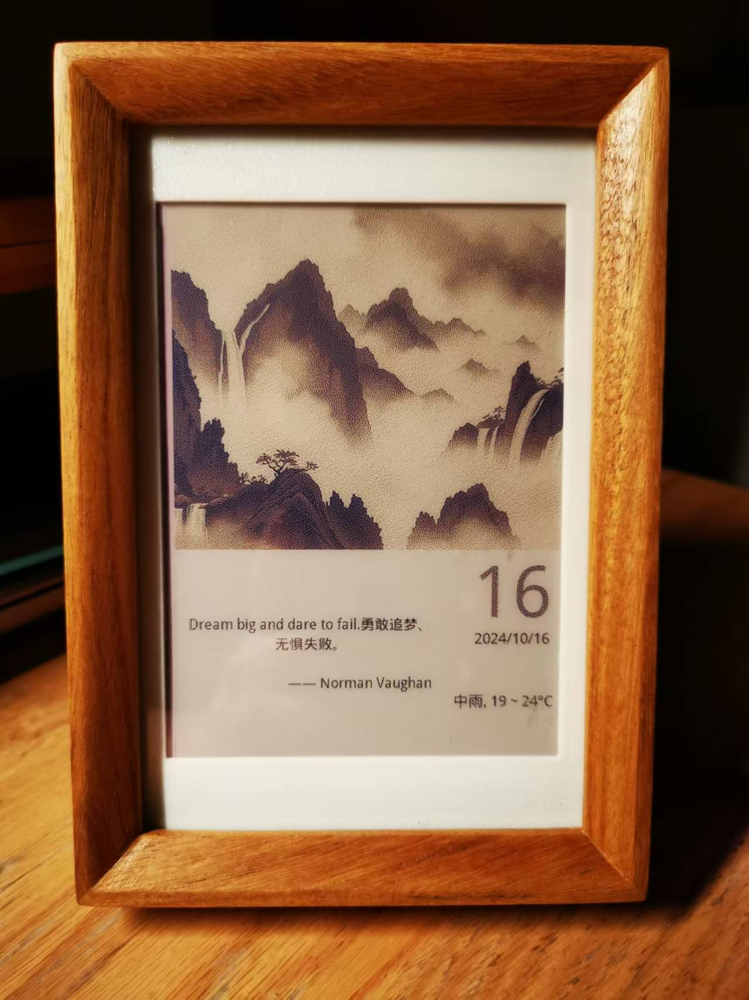
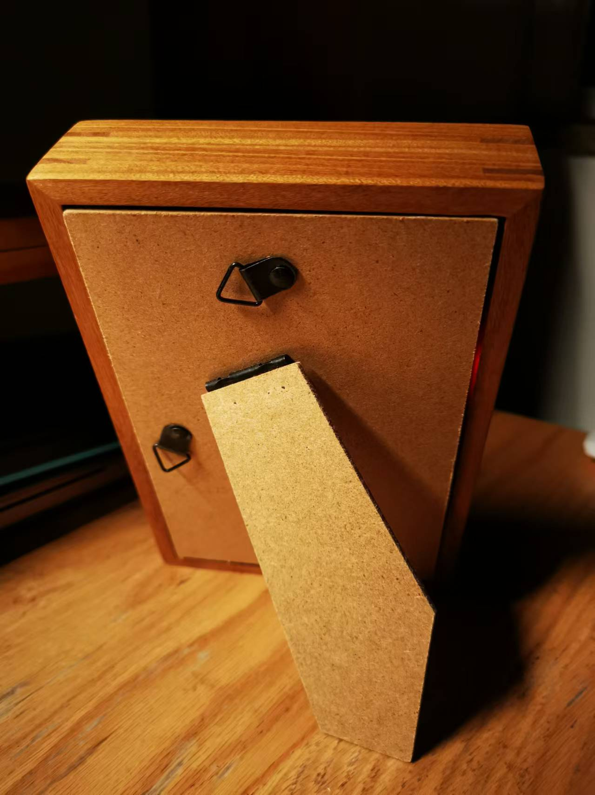
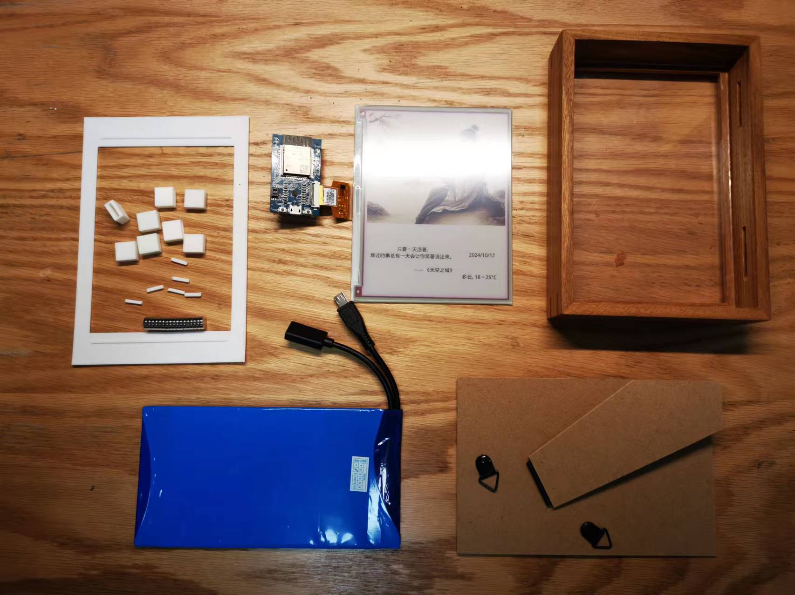
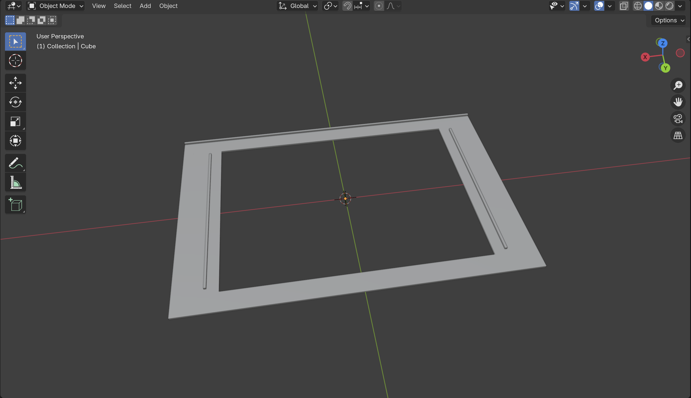
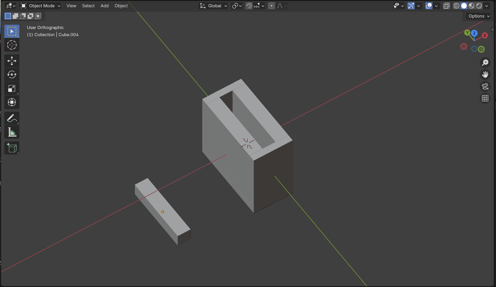
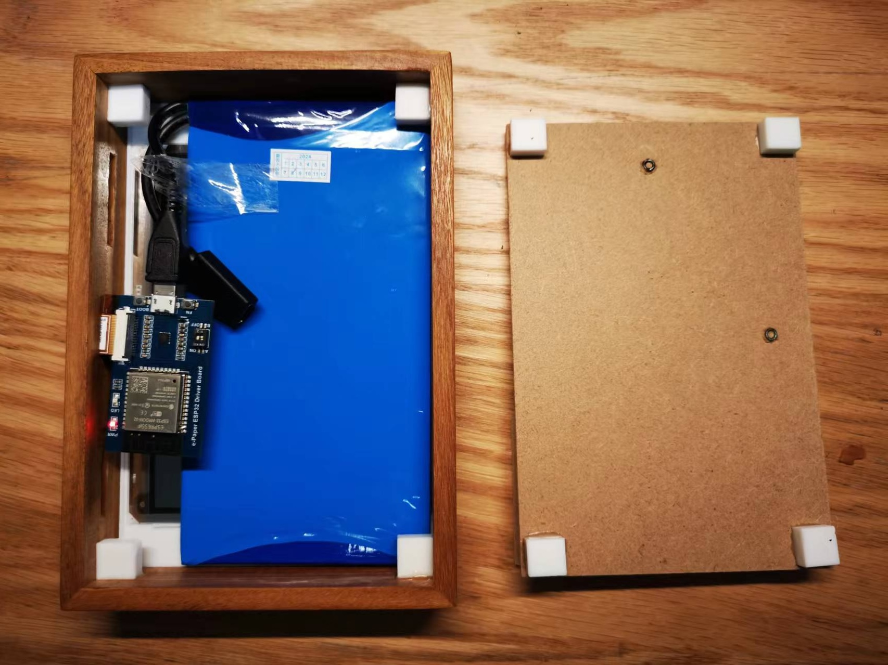

# Eink-AI-Calendar

English | [中文版](README-zh.md)

This is an ESP32-based E-ink AI Calendar. Like time itself - which cannot hold onto yesterday, makes each day new, and keeps tomorrow unknown - it displays daily images and text that cannot be saved or changed, with a low-power, switch-free design.

## 1. Features

- Displays date, weather, and holiday information
- Shows daily inspirational quotes
- Displays AI-generated images based on weather, holidays, and quotes
- Automatically updates at midnight





## 2. Hardware & Appearance



### 2.1 Hardware

Uses low-power hardware components:

- Screen: Waveshare 5.65-inch 7-color E-ink display [5.65inch e-Paper Module (F)](https://www.waveshare.net/shop/5.65inch-e-Paper-Module-F.htm)
- Driver Board: Waveshare ESP32 module with E-ink display driver [e-Paper-ESP32-Driver-Board](https://www.waveshare.net/shop/e-Paper-ESP32-Driver-Board.htm)
- Battery: ZhongShunXin 5V constant voltage lithium battery 5000mAh (size chosen based on frame interior dimensions), with Type-C female charging port and microUSB male discharge port

### 2.2 Appearance

- Frame: 6-inch (10.2 cm \* 15.2 cm) wooden photo frame from online marketplace, specifically chosen with 3cm thickness to accommodate chips and battery
- Back Panel: Separate 6-inch photo album back panel (original wooden back panel was too thick)
- Frame & Back Panel Connection: Magnetic attachment for easy charging and debugging. Uses 8mm diameter, 2mm thick circular magnets
- 3D Printed Parts: A frame mask to center the screen and cover screen edges; 8 small boxes to house magnets, increasing adhesion area and reducing excessive magnetic force (source files in /3d directory)






## 3. Software

### 3.1 Architecture

- Client/Server Architecture: Due to ESP32's limited computing power, a C/S architecture is used. ESP32 acts as client, reading processed byte data from HTTP endpoints to display on the E-ink screen, reducing ESP32's workload.

### 3.2 Client

The client handles update detection and image rendering.

- Update Timing:
  - Daily midnight updates: ESP32 wakes hourly, connects to WiFi for time check, updates calendar if midnight
  - Updates on power connection or reset: Updates when esp_reset_reason() returns ESP_RST_POWERON, useful for initialization and debugging
- Rendering Method: Due to limited documentation on partial refresh, full screen refresh is used. All image and data processing happens server-side. Note: Screen refresh interval should be >30s to prevent damage from frequent updates.

### 3.3 Server

The server handles data aggregation and image processing.

- Data Aggregation: Retrieves weather, holiday information, and AI-generated images through APIs
- Image Processing: Converts quote text and holiday information to images, combines with AI images into calendar layout, applies dithering algorithms and data compression

View calendar preview through the /show endpoint.


ESP32 retrieves data through the /bytes endpoint.

## 4. Setup

### 4.1 Server Deployment

Choose between local Python deployment or Docker.

#### 4.1.1 Local Deployment

- Install Python 3.8 and dependencies
- Rename server/config_demo.py to config.py and fill in weather, AI, and other configuration details
- Run python app.py to start web service. Verify through /show and /bytes endpoints. /show should display calendar image, /bytes should return 134KB image data.

#### 4.1.2 Docker Deployment (Synology Example)

- Debug locally following 4.1.1
- Install [docker](https://docs.docker.com/desktop/install/mac-install/)
- Build image in server directory. For Mac building targeting Synology, use [buildx](https://github.com/docker/buildx) for linux/amd64 architecture:

```bash
docker buildx build --platform linux/amd64 -t eink-calendar-server:amd64 --load .
```

- Export image to tar:

```bash
docker save -o eink-calendar-server.tar eink-calendar-server:amd64
```

- Install Docker package on Synology, import image, create container.

### 4.2 ESP32 Programming

#### 4.2.1 Environment Setup and Verification

- Follow [E-Paper_ESP32_Driver_Board](https://www.waveshare.net/wiki/E-Paper_ESP32_Driver_Board) documentation to install [Arduino IDE and ESP32 drivers](https://www.waveshare.net/wiki/Template:Arduino_ESP32/8266_Offline_Installation)
- Run official demos to verify WiFi and Bluetooth functionality, image display

#### 4.2.2 Calendar Program Upload

Rename esp32/config_demo.h to config.h, fill in WiFi details and server IP/port from previous step, then upload.

## 5. Acknowledgments

- Thanks to LiangGao's [article](https://sspai.com/post/82704) for inspiration and key technical insights on C/S architecture and data compression
- Special thanks to [Debatrix](https://github.com/Debatrix) and their [Eink-Calendar](https://github.com/Debatrix/eInkPhotoAlbum) project, which this project heavily references and simplifies using cursor
