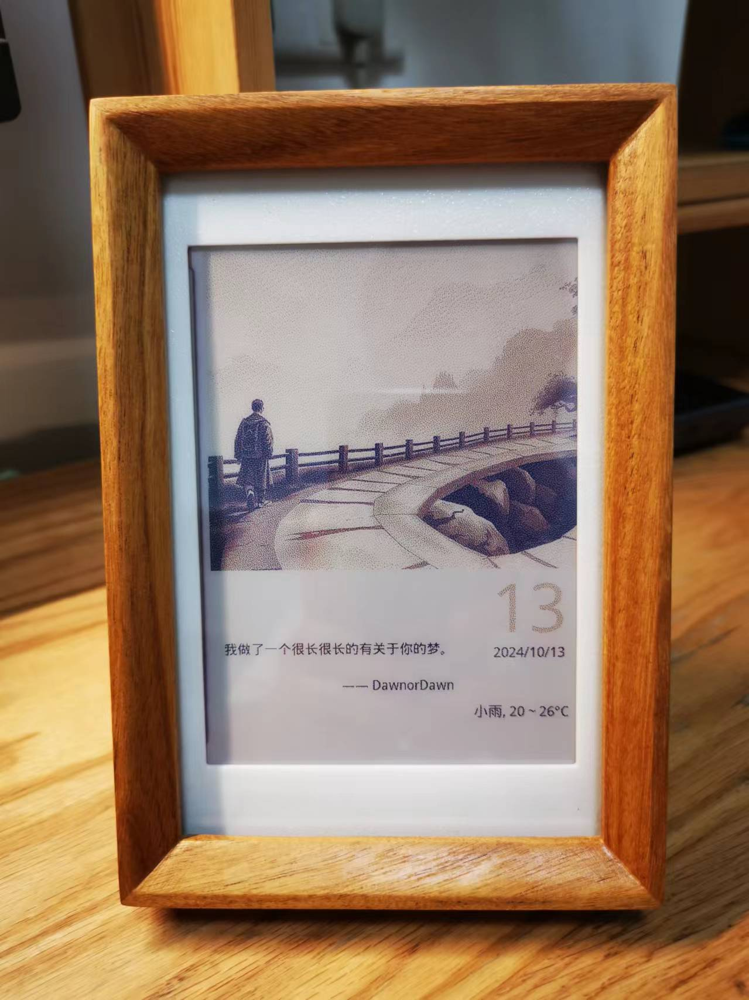
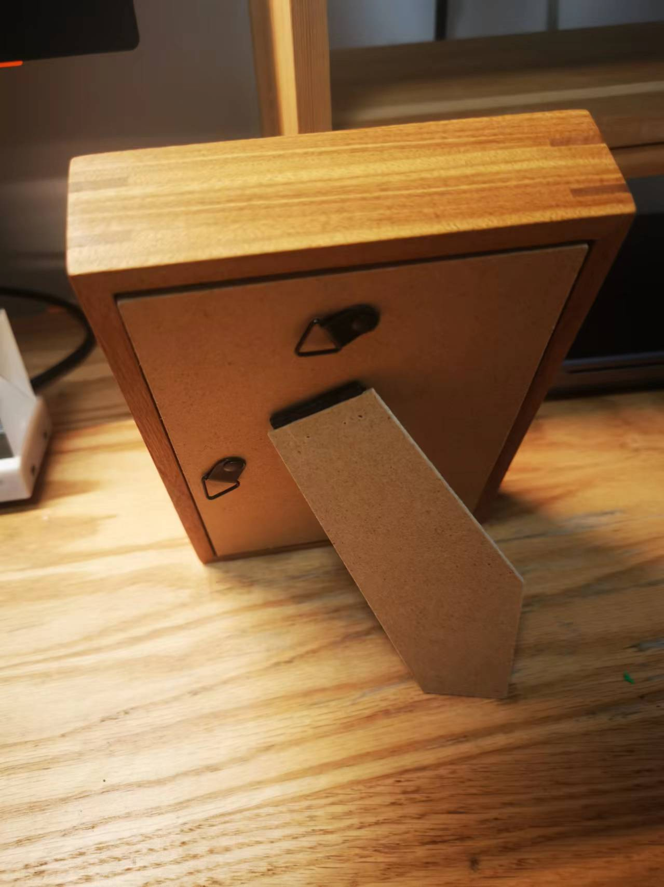
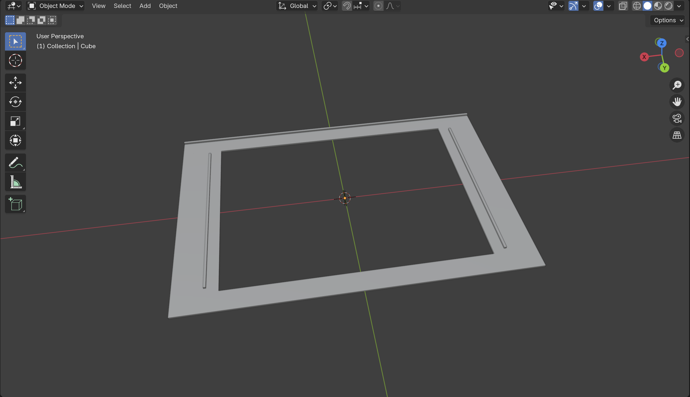
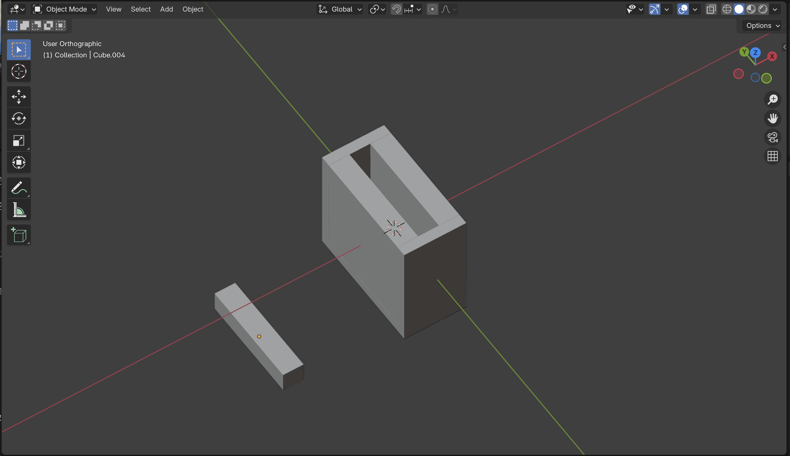
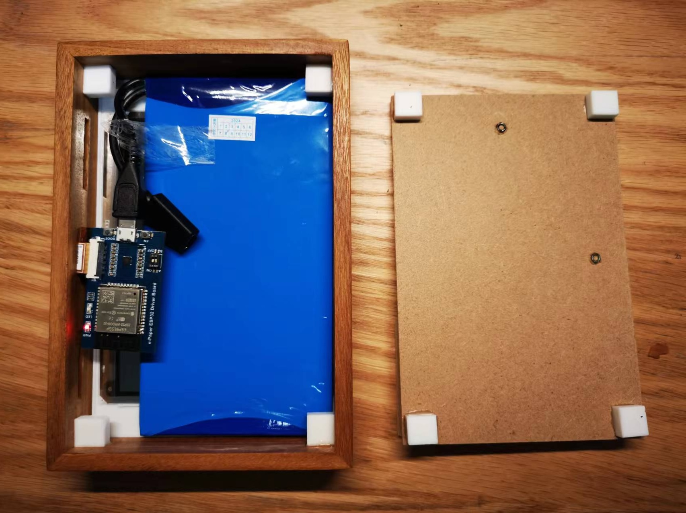

# Eink-AI-Calendar

这是一款基于 ESP32 的电子墨水 AI 日历。只属于当天的不可保存不可变更的图文，和低功耗无开关设计，恰似昨日不可留，今日如新，明日不可知，静默流逝而不觉的时光。

## 1. 功能

- 显示日期、天气、节日信息。
- 显示每日一句格言。
- 显示 AI 根据天气、节日、格言生成的图片。
- 凌晨自动更新。




## 2. 硬件 & 外观


### 2.1 硬件

采用低功耗的硬件方案：

- 屏幕：微雪的 5.65 寸 7 色 电子墨水屏 [5.65inch e-Paper Module (F)](https://www.waveshare.net/shop/5.65inch-e-Paper-Module-F.htm)
- 驱动板：微雪的带电子墨水屏驱动的 ESP32 模块。[e-Paper-ESP32-Driver-Board](https://www.waveshare.net/shop/e-Paper-ESP32-Driver-Board.htm)
- 电池：中顺芯 5V 恒压锂电池 5000mAh（尺寸根据相框内框大小购买），充电 type-c 母，放电 microUSB 公。

### 2.2 外观

- 外壳：某宝购买的 6寸 (10.2 cm * 15.2 cm) 木质相框, 因为内部要放芯片和电池，特地选择厚度达 3cm 的相框。
- 背板：因为原相框的木质背板比较厚，因此再单独购买 6 寸相册背板。
- 外壳 & 背板连接：采用磁吸方式，便于后续充电和调试。磁铁是直径 8mm 厚度 2mm 的圆形磁铁。
- 3D 打印：一个外框遮罩，用于固定屏幕居中，和遮挡屏幕边缘；8个小盒子，用于放置磁铁，来增大粘合的面积，减少一些过强的吸力。(在 /3d 目录下有源文件)




 

## 3. 软件

### 3.1 架构

- C/S 架构：因为 ESP32 算力有限，采用 C/S 架构，ESP32 作为客户端，从 http 接口读取处理好的 byte 数据，显示在电子墨水屏上，来减少 ESP32 的压力。

### 3.2 客户端
客户端主要具备更新检测和图片渲染两个功能。

- 更新时机：通过每小时 ESP32 的定时唤醒，唤醒后连接 wifi 获取时间，检查是否到凌晨，如果是凌晨则更新日历信息，来达到每日更新的效果。
- 渲染方式：局部刷新的文档太少也没找到相关资料，因此也采用全部刷新的方式，即每次更新都重新绘制整个屏幕，图片和数据处理都在服务端实现。需要注意的是该电子墨水屏刷新时间建议控制在 30s 以上，调试过程避免频繁刷新损坏屏幕。

### 3.3 服务端
服务端主要是数据聚合和图片处理。
- 聚合数据：通过聚合数据提供的 API 获取天气、节日信息，以及 AI 生成图片数据。
- 图片处理：包括格言文字转图片，节日信息文字转图片，和 AI 图片整个拼接成日历大图，以及后续的颜色抖动算法和数据压缩处理。

可以通过 /show 接口来查看日历效果。
 

实际使用是ESP32 通过请求 /bytes 接口来获取数据。


## 4. 运行

### 4.1 部署服务端

可以采用本地运行 python 代码，或者 docker 部署。

#### 4.1.1 本地部署

- 安装 python 3.8 环境，并安装依赖。
- 将 server/config_demo.py 修改为 config.py，并填入天气、AI、等具体的配置项。
- 执行 python app.py 启动 web 服务。通过访问 /show， /bytes 接口来确认服务端是否正常。正常情况 show 能展示日历图片，bytes 接口能返回大小为 134KB 的图片数据。

#### 4.1.2 使用 docker 部署（以群晖 Docker 为例）

- 参考 4.1.1 步骤，调试本地运行正常。
- 安装 [docker](https://docs.docker.com/desktop/install/mac-install/) 
- 在 server 目录构建镜像。我使用的是 mac 构建，构建的镜像希望部署在群晖运行，因此使用 [buildx](https://github.com/docker/buildx) 来构建 linux/amd64 系统架构的镜像

```bash
docker buildx build --platform linux/amd64 -t eink-calendar-server:amd64 --load . 
```

- 镜像完成后，导出镜像为 tar 包：

```bash
docker save -o eink-calendar-server.tar eink-calendar-server:amd64
```

- 群晖安装 docker 套件，导入镜像，创建容器即可。

### 4.2 烧录 ESP32

#### 4.2.1 配置环境及验证

- 参考 [E-Paper_ESP32_Driver_Board](https://www.waveshare.net/wiki/E-Paper_ESP32_Driver_Board) 文档，安装 [Arduino IDE 和 esp32 驱动](https://www.waveshare.net/wiki/%E6%A8%A1%E6%9D%BF:Arduino_ESP32/8266_Offline_Installation)。
- 运行上面文档提供的官方 demo，通过 WiFi例程 来确认 ESP32 正常运行 WIFI； 通过蓝牙例程 来确认 ESP32 正常运行蓝牙，上传展示图片。

#### 4.2.2 烧录日历程序

将 esp32/config_demo.h 修改为 config.h，并填入 wifi 信息。和上一步服务端的 ip 地址和端口号。然后烧录。

## 5. 感谢

- 感谢凉糕的 [《我在数字时代做了一个电子日历，让油画和照片可以被装进去》](https://sspai.com/post/82704)，让我有了做这个日历的想法，其中也包含了 C / S 架构说明和如何进行数据压缩的关键技术。
- 特别感谢 [Debatrix](https://github.com/Debatrix) 的 [Eink-Calendar](https://github.com/Debatrix/eInkPhotoAlbum) 项目，可以说我的整个项目都是基于此项目，通过 cursor 进行修改简化，借鉴了绝大部分程序设计。